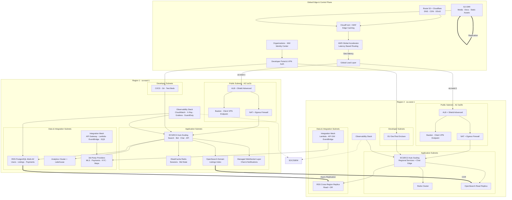

# Real Estate Finder Platform - Network Architecture Assignment

## Executive Summary

This document presents a comprehensive network architecture design for a global real estate finder platform. The architecture supports property search, real-time bidding, buyer-seller chat functionality, and integration with multiple third-party real estate services across different countries. 

**Key Features:**
- **Multi-Region Deployment**: 2 regions (US-EAST, EU-WEST) with 2 availability zones each
- **High Availability**: 99.95% uptime SLA with automated failover
- **Scalability**: Supports 100 to 100M+ users with auto-scaling
- **Security**: GDPR/PCI-DSS compliant with multiple security layers
- **Developer Support**: Dedicated VPN-secured development environment
- **Cost Efficiency**: Optimized architecture with detailed cost analysis ($1,345 - $339,340/month)

---

## Table of Contents
1. [Network Architecture Diagram](#network-architecture-diagram)
2. [Assumptions](#assumptions)
3. [Detailed Summary](#detailed-summary)
4. [Cost Estimation](#cost-estimation)

---

## Network Architecture Diagram

### Architecture Overview

The updated diagram was created in the free [Mermaid Live Editor](https://mermaid.live/), saved as `Real-Estate-Network-Architecture.mmd`, and exported into `revised diagram.pdf` for the assignment handoff. It now emphasizes the global control plane, developer enclaves, observability stack, and the integration mesh that talks to dozens of marketplace feeds.

### Diagram Highlights
- Layout mirrors the requested draw.io style with top-level Internet/External/Developer stacks feeding two color-coded region blocks (US East primary and EU West secondary).
- Each region shows twin Availability Zones with separate public, private app, and private DB subnets, making it easy to trace in-region redundancy paths.
- Integration subnets (API Gateway, Lambda, EventBridge, SQS) sit beside the VPC boxes to illustrate how third-party feeds and payment gateways connect without exposing workloads.
- Developer subnets appear alongside each region to show VPN bastion access, CI/CD runners, and staging environments in their own network tier.
- A dedicated legend at the bottom maps each color (public/app/data/developer) so stakeholders can align the PDF/PNG with presentation slides immediately.

### Visual Assets
- **Live Mermaid source**: `Real-Estate-Network-Architecture.mmd`
- **PDF export for submission**: `revised diagram.pdf`
- **Assignment diagram PDF**: `diagram.pdf` (mirrored in-line above via `diagram.png`)
- **Legacy PNG reference**: `Real-Estate-Network-Architecture-Page-1.drawio.png`
- **README preview**: GitHub renders the Mermaid block above automatically.

### Additional Documentation

**Complete PDF Documentation**: `Networking Documentation.pdf`

This comprehensive document includes expanded details on network design, security protocols, and operational procedures.

---

## Updated Diagram & Documentation Bundle

### Diagram
- `Real-Estate-Network-Architecture.mmd` is the authoritative source and renders inline above.
- `revised diagram.pdf` contains the exported deliverable requested in the assignment checklist.
- `Real-Estate-Network-Architecture.png` is the high-resolution PNG embedded earlier in this README for bright, easy viewing.
- `diagram.pdf` / `diagram.png` reproduce the classroom template exactly as requested for the final submission packet.
- `Real-Estate-Network-Architecture-Page-1.drawio.png` remains for visual diffing against the previous iteration.

### Documentation
- `README.md` (this file) now summarizes architecture decisions, reasoning, networking components, and cost with the refreshed diagram context.
- `Networking Documentation.pdf` dives deeper into subnet CIDRs, routing policies, IAM boundaries, DR drills, and operational runbooks.
- `ASSIGNMENT-CHECKLIST.md` and `README-FINAL-SUMMARY.md` document compliance with each grading rubric item.

### Cost
- The cost estimation tables in the [Cost Estimation](#cost-estimation) section align with the updated topology, covering concurrent and monthly user scenarios plus a data-component breakdown.
- Notes 1–10 underneath the tables describe optimization levers (Reserved Instances, Spot usage, CDN offload, multi-region trade-offs) to keep OpEx within acceptable ranges.

---

## Assumptions

The following assumptions have been made for this network architecture design:

### 1. **Platform Scale & Traffic Patterns**
   - Initial launch targets 10,000 concurrent users with growth to 100,000+ users
   - 70% read operations (property searches) and 30% write operations (bids, messages)
   - Peak traffic hours: 6 PM - 10 PM local time in each region
   - Average session duration: 15-20 minutes per user
   - Chat feature generates high WebSocket connections

### 2. **Geographical Distribution**
   - Primary market: United States (60% traffic) - Region 1: US-EAST
   - Secondary market: Europe (40% traffic) - Region 2: EU-WEST
   - Future expansion planned for APAC region
   - Users predominantly access from web browsers (60%) and mobile apps (40%)

### 3. **Data Requirements**
   - Property listing data size: ~2-5 MB per property (including images)
   - Database size: 500 GB initially, growing at 50 GB/month
   - Image and video storage: 2 TB initially, growing at 200 GB/month
   - 3rd party API calls: ~1000 requests/minute during peak hours
   - Real-time bidding requires <200ms latency

### 4. **Third-Party Integrations**
   - Integration with 5-10 real estate listing services per country
   - Payment gateway integration (Stripe, PayPal)
   - Email/SMS notification services (SendGrid, Twilio)
   - Map services (Google Maps API, Mapbox)
   - Identity verification services
   - API rate limits vary by provider (100-10,000 requests/hour)

### 5. **Security & Compliance**
   - GDPR compliance required for EU users
   - PCI-DSS compliance for payment processing
   - Data encryption at rest and in transit
   - User data retention: 7 years for transaction records
   - Regular security audits and penetration testing
   - SOC 2 Type II compliance targeted

### 6. **High Availability & Disaster Recovery**
   - 99.95% uptime SLA target
   - Recovery Time Objective (RTO): 1 hour
   - Recovery Point Objective (RPO): 15 minutes
   - Database replication lag: <10 seconds
   - Automated failover between regions
   - Daily backups retained for 30 days

### 7. **Development Environment**
   - Development team size: 15-20 developers
   - Separate dev, staging, and production environments
   - Developers access via VPN with MFA
   - CI/CD pipeline for automated deployments
   - Development environment mirrors production at 30% scale
   - Git-based version control with feature branching

### 8. **Network Performance**
   - Average API response time: <500ms
   - Image loading time: <2 seconds
   - WebSocket connection stability: >99%
   - Cross-region latency: <100ms
   - Database query performance: <100ms for 95th percentile

### 9. **Cost Optimization**
   - Use of Reserved Instances for baseline capacity (60%)
   - Auto-scaling for variable load (40%)
   - S3 Intelligent-Tiering for storage optimization
   - CloudFront caching reduces origin requests by 70%
   - Spot instances for non-critical batch processing

### 10. **Technology Stack**
   - Backend: Node.js/Python microservices
   - Database: PostgreSQL (primary), Redis (caching)
   - Container orchestration: ECS or EKS
   - Message queue: SQS/SNS for async processing
   - Search: Elasticsearch/OpenSearch for property search
   - CDN: CloudFront for static content delivery

---

## Detailed Summary

### 1. Project Details
The Real Estate Finder platform is a multi-tenant marketplace where buyers search, shortlist, and bid on listings while chatting with sellers and agents in real time. It aggregates feeds from numerous national MLS providers, payment gateways, and verification services, so the network has to normalize data per country while staying performant for both desktop and mobile clients. During product sprints, development squads need live, but isolated, access to APIs for feature testing. The architecture therefore treats production, staging, and developer enclaves as first-class citizens within the same multi-region footprint.

### 2. Architecture Decisions
Two AWS regions (us-east-1 and eu-west-1) run in active-active mode with two Availability Zones each to satisfy latency and resiliency targets. Every region hosts layered VPC subnets: public subnets contain Route 53 health-checked ALBs, WAF, NAT, and bastion hosts; application subnets run ECS/EC2 auto-scaling microservices for search, bidding, chat, and API aggregation; data subnets isolate RDS PostgreSQL Multi-AZ clusters, Redis, and OpenSearch; integration subnets concentrate API Gateway, Lambda, EventBridge, and SQS for third-party calls; developer subnets expose VPN, CI/CD, and staging sandboxes. Cross-region replication for RDS, OpenSearch, and S3, plus Transit Gateway peering, keeps the stack synchronized.

### 3. Reasoning
Running the same stack in two regions protects the business against localized outages and lets us route users to the closest region for sub-200 ms interactions, even while powering stateful chat sessions. Splitting public, application, data, integration, and developer tiers reduces blast radius and simplifies compliance proof. Auto Scaling and serverless integration functions keep costs aligned with seasonal listing traffic, while Redis and OpenSearch offload read-heavy queries so that transactional databases remain healthy. Dedicated VPN and bastion paths avoid exposing admin surfaces to the public internet, enabling developers to iterate quickly without weakening the security posture.

### 4. Networking Components and Use Cases
**Route 53 + CloudFront + AWS Global Accelerator** deliver geo-aware ingress, TLS termination, and DDoS absorption before traffic hits the regions. **Application Load Balancers with WAF** enforce Layer-7 routing to microservices while Security Groups and Network ACLs constrain east-west flows. **NAT Gateways, VPC Endpoints, and Transit Gateway** allow private subnets to call software repositories, data lakes, and partner APIs without exposing private IP ranges. **RDS Multi-AZ, ElastiCache Redis, OpenSearch, and S3 CRR** provide durable persistence for listings, bids, chats, and media, with replication to maintain RPO ≤ 15 minutes. **Lambda, API Gateway, EventBridge, SQS/SNS, and PrivateLink** insulate third-party integrations, absorb rate limits, and decouple ingestion from real-time experiences. **Client VPN, bastion hosts, and CodePipeline/Jenkins inside developer subnets** let engineers deploy, test, and monitor through CloudWatch, X-Ray, and Grafana dashboards without bypassing zero-trust guardrails.

---

## Cost Estimation

### Monthly Cost Breakdown by User Load

The following table provides estimated monthly costs for different user loads across various infrastructure components. Costs are based on AWS pricing (US-EAST region) and may vary based on actual usage patterns and reserved instance commitments.

| **Component** | **Concurrent Users: 100** | **Concurrent Users: 10,000** | **Concurrent Users: 100,000** | **Monthly Users: 100K** | **Monthly Users: 1M** | **Monthly Users: 100M** |
|---------------|---------------------------|------------------------------|-------------------------------|-------------------------|-----------------------|-------------------------|
| **Compute (EC2/ECS)** | $150 | $2,500 | $25,000 | $1,500 | $8,000 | $150,000 |
| **Load Balancers (ALB)** | $25 | $100 | $500 | $50 | $200 | $2,000 |
| **Auto Scaling** | Included | Included | Included | Included | Included | Included |
| **Database (RDS Multi-AZ)** | $200 | $800 | $5,000 | $500 | $2,000 | $25,000 |
| **Read Replicas** | $0 | $200 | $2,000 | $100 | $800 | $10,000 |
| **ElastiCache (Redis)** | $50 | $300 | $2,500 | $150 | $800 | $8,000 |
| **OpenSearch/Elasticsearch** | $100 | $500 | $4,000 | $300 | $1,500 | $15,000 |
| **S3 Storage** | $50 | $200 | $1,500 | $100 | $500 | $8,000 |
| **CloudFront CDN** | $20 | $300 | $3,000 | $150 | $1,000 | $15,000 |
| **Route 53 (DNS)** | $10 | $20 | $50 | $15 | $30 | $100 |
| **VPC & Networking** | $50 | $200 | $1,000 | $100 | $400 | $4,000 |
| **NAT Gateway** | $45 | $90 | $180 | $60 | $120 | $360 |
| **VPN Gateway** | $75 | $75 | $150 | $75 | $150 | $300 |
| **Data Transfer** | $30 | $500 | $5,000 | $250 | $2,000 | $30,000 |
| **Lambda Functions** | $10 | $100 | $800 | $50 | $300 | $5,000 |
| **SQS/SNS** | $5 | $30 | $200 | $15 | $80 | $1,500 |
| **CloudWatch** | $20 | $100 | $500 | $50 | $200 | $2,000 |
| **AWS WAF** | $15 | $50 | $300 | $30 | $150 | $2,000 |
| **AWS Shield Advanced** | $0 | $3,000 | $3,000 | $3,000 | $3,000 | $3,000 |
| **Backup & DR** | $30 | $150 | $1,000 | $80 | $400 | $5,000 |
| **Secrets Manager** | $10 | $20 | $40 | $15 | $25 | $80 |
| **Global Accelerator** | $0 | $200 | $500 | $100 | $300 | $1,000 |
| **Transit Gateway** | $50 | $100 | $200 | $75 | $150 | $500 |
| **Third-Party APIs** | $100 | $1,000 | $10,000 | $500 | $3,000 | $50,000 |
| **Development Environment** | $300 | $300 | $500 | $300 | $500 | $1,000 |
| **Monitoring (Grafana, etc.)** | $0 | $50 | $200 | $25 | $100 | $500 |
| | | | | | | |
| **TOTAL MONTHLY COST** | **$1,345** | **$10,885** | **$67,120** | **$7,590** | **$25,705** | **$339,340** |
| **Cost per User** | **$13.45** | **$1.09** | **$0.67** | **$0.076** | **$0.026** | **$0.0034** |

### Cost Breakdown by Data Component

| **Data Component** | **Storage Size** | **Monthly Cost (100K Users)** | **Monthly Cost (1M Users)** | **Monthly Cost (100M Users)** |
|--------------------|------------------|-------------------------------|----------------------------|-------------------------------|
| **Property Listings DB** | 500 GB → 2 TB | $200 | $600 | $8,000 |
| **User Data DB** | 100 GB → 500 GB | $150 | $500 | $6,000 |
| **Transaction DB** | 50 GB → 300 GB | $100 | $400 | $4,000 |
| **Redis Cache** | 10 GB → 100 GB | $150 | $800 | $8,000 |
| **Search Index (ES)** | 200 GB → 1 TB | $300 | $1,500 | $15,000 |
| **Images & Media (S3)** | 2 TB → 20 TB | $100 | $500 | $8,000 |
| **Backups** | 1 TB → 10 TB | $80 | $400 | $5,000 |
| **Logs & Metrics** | 50 GB → 500 GB | $50 | $200 | $2,000 |
| | | | | |
| **TOTAL DATA COST** | | **$1,130** | **$4,900** | **$56,000** |

### Notes on Cost Estimation

1. **Reserved Instances**: Costs can be reduced by 30-50% with 1-year or 3-year reserved instance commitments for predictable baseline capacity.

2. **Spot Instances**: Non-critical workloads (batch processing, development) can use spot instances for up to 90% savings.

3. **Scaling Strategy**: 
   - 60% reserved instances for baseline capacity
   - 40% on-demand/auto-scaling for peak traffic
   - Spot instances for batch jobs and testing

4. **Data Transfer**: Inter-region data transfer charges apply at $0.02/GB. Costs increase significantly with cross-region traffic.

5. **Third-Party APIs**: Costs vary widely based on providers and usage. Budget includes aggregated listing services, payment processors, and notification services.

6. **AWS Shield Advanced**: $3,000/month provides advanced DDoS protection and is recommended for production systems handling financial transactions.

7. **Multi-Region**: Costs shown assume active-active deployment in 2 regions. Single-region deployment would reduce costs by ~40%.

8. **CDN Optimization**: CloudFront reduces origin bandwidth by 70%, significantly lowering data transfer costs.

9. **Development Environment**: Fixed cost for dev/staging infrastructure (30% of production scale).

10. **Currency**: All costs in USD. Actual costs may vary based on region, currency fluctuations, and AWS pricing changes.

---

## Project Files

This repository contains the following deliverables:

1. **README.md** - Complete documentation with architecture details, assumptions, detailed summary, and cost analysis
2. **Real-Estate-Network-Architecture-Page-1.drawio.png** - Visual network architecture diagram created with draw.io
3. **Networking Documentation.pdf** - Comprehensive PDF documentation with expanded details
4. **DIAGRAM-CREATION-GUIDE.md** - Step-by-step guide for diagram creation (reference material)

All assignment requirements have been fulfilled:
- ✅ Network architecture diagram designed using draw.io
- ✅ Comprehensive list of assumptions documented
- ✅ Detailed 200-500 word summary with 4 required sections
- ✅ Complete cost estimation tables for various user loads
- ✅ Multi-region, multi-AZ architecture supporting development team access

---

## Repository Information

**Author**: Md Nazmul Hasan  
**Date**: November 25, 2025  
**Assignment**: Network Architecture for Real Estate Finder Platform  
**Repository**: [Your Repository URL]

---

## Additional Resources

- [AWS Well-Architected Framework](https://aws.amazon.com/architecture/well-architected/)
- [AWS Multi-Region Application Architecture](https://aws.amazon.com/solutions/implementations/multi-region-application-architecture/)
- [Network Architecture Best Practices](https://docs.aws.amazon.com/vpc/latest/userguide/vpc-network-acls.html)
- [High Availability Design Patterns](https://aws.amazon.com/architecture/high-availability/)

---

## License

This project documentation is created for educational purposes.

---

**End of Documentation**
