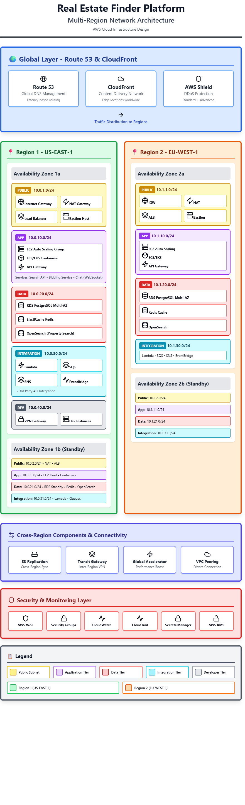

# Real Estate Finder Platform - Network Architecture Assignment

## Executive Summary

This document presents a comprehensive network architecture design for a global real estate finder platform. The architecture supports property search, real-time bidding, buyer-seller chat functionality, and integration with multiple third-party real estate services across different countries. 

**Key Features:**
- **Multi-Region Deployment**: 2 regions (US-EAST, EU-WEST) with 2 availability zones each
- **High Availability**: 99.95% uptime SLA with automated failover
- **Scalability**: Supports 100 to 100M+ users with auto-scaling
- **Security**: GDPR/PCI-DSS compliant with multiple security layers
- **Developer Support**: Dedicated VPN-secured development environment
- **Cost Efficiency**: Optimized architecture with detailed cost analysis ($1,345 - $339,340/month)

---

## Table of Contents
1. [Network Architecture Diagram](#network-architecture-diagram)
2. [Assumptions](#assumptions)
3. [Detailed Summary](#detailed-summary)
4. [Cost Estimation](#cost-estimation)

---

## Network Architecture Diagram

### Architecture Overview

The diagram below illustrates the multi-region, multi-availability zone network architecture for the Real Estate Finder platform:

**Diagram Link**: [View on draw.io](https://app.diagrams.net/)

### Diagram Description

```
┌─────────────────────────────────────────────────────────────────────────────┐
│                          CLOUDFLARE / ROUTE 53 (DNS & CDN)                  │
│                         Global Load Balancing & DDoS Protection             │
└────────────────────────────────┬────────────────────────────────────────────┘
                                 │
                ┌────────────────┴────────────────┐
                │                                 │
    ┌───────────▼──────────┐         ┌───────────▼──────────┐
    │   REGION 1 (US-EAST) │         │  REGION 2 (EU-WEST)  │
    │   Primary Region     │         │   DR/Active Region   │
    └──────────────────────┘         └──────────────────────┘
                │                                 │
    ┌───────────┴───────────┐         ┌──────────┴───────────┐
    │                       │         │                      │
┌───▼────┐          ┌───────▼───┐ ┌──▼─────┐        ┌───────▼───┐
│  AZ-1a │          │   AZ-1b   │ │ AZ-2a  │        │   AZ-2b   │
└────────┘          └───────────┘ └────────┘        └───────────┘

Each Availability Zone Contains:
════════════════════════════════

┌─────────────────────────────────────────────────────────────────┐
│                      VPC (10.0.0.0/16 per region)               │
├─────────────────────────────────────────────────────────────────┤
│                                                                 │
│  ┌──────────────────────────────────────────────────────────┐  │
│  │ Public Subnet (10.0.1.0/24, 10.0.2.0/24)                 │  │
│  │  - Internet Gateway                                      │  │
│  │  - NAT Gateway                                           │  │
│  │  - Application Load Balancer (ALB)                       │  │
│  │  - Bastion Host (Jump Server)                            │  │
│  │  - CloudFront Edge Locations                             │  │
│  └──────────────────────────────────────────────────────────┘  │
│                          │                                      │
│  ┌──────────────────────────────────────────────────────────┐  │
│  │ Private Subnet - Application Tier (10.0.10.0/24)         │  │
│  │  - Auto Scaling Group                                    │  │
│  │  - EC2 Instances (Web Servers)                           │  │
│  │    * Real Estate Search API                              │  │
│  │    * Bidding Service                                     │  │
│  │    * Chat Service (WebSocket)                            │  │
│  │  - ECS/EKS Containers                                    │  │
│  │  - API Gateway                                           │  │
│  └──────────────────────────────────────────────────────────┘  │
│                          │                                      │
│  ┌──────────────────────────────────────────────────────────┐  │
│  │ Private Subnet - Data Tier (10.0.20.0/24)                │  │
│  │  - RDS Multi-AZ (PostgreSQL/MySQL)                       │  │
│  │    * User Data                                           │  │
│  │    * Property Listings                                   │  │
│  │    * Bids & Transactions                                 │  │
│  │  - ElastiCache (Redis)                                   │  │
│  │    * Session Management                                  │  │
│  │    * Real-time Bid Cache                                 │  │
│  │  - OpenSearch/Elasticsearch                              │  │
│  │    * Property Search Index                               │  │
│  └──────────────────────────────────────────────────────────┘  │
│                          │                                      │
│  ┌──────────────────────────────────────────────────────────┐  │
│  │ Private Subnet - Integration Tier (10.0.30.0/24)         │  │
│  │  - Lambda Functions                                      │  │
│  │    * 3rd Party API Integration                           │  │
│  │    * Data Transformation                                 │  │
│  │  - SQS/SNS (Message Queue)                               │  │
│  │  - EventBridge                                           │  │
│  │  - VPC Endpoints (PrivateLink)                           │  │
│  └──────────────────────────────────────────────────────────┘  │
│                          │                                      │
│  ┌──────────────────────────────────────────────────────────┐  │
│  │ Private Subnet - Developer Environment (10.0.40.0/24)    │  │
│  │  - VPN Gateway / AWS Client VPN                          │  │
│  │  - Development EC2 Instances                             │  │
│  │  - CI/CD Pipeline (Jenkins/GitLab)                       │  │
│  │  - Code Repository                                       │  │
│  │  - Testing Environment                                   │  │
│  └──────────────────────────────────────────────────────────┘  │
│                                                                 │
└─────────────────────────────────────────────────────────────────┘

Cross-Region Components:
═══════════════════════

┌──────────────────────────────────────────────────────────────┐
│ Global Services & Storage                                    │
├──────────────────────────────────────────────────────────────┤
│ - S3 (Cross-Region Replication)                              │
│   * Property Images & Videos                                 │
│   * User Documents                                           │
│   * Static Website Assets                                    │
│                                                              │
│ - CloudFront CDN (Global Edge Locations)                     │
│   * Content Delivery                                         │
│   * DDoS Protection                                          │
│                                                              │
│ - Route 53 (DNS)                                             │
│   * Geo-routing                                              │
│   * Health Checks                                            │
│   * Failover Configuration                                   │
│                                                              │
│ - AWS Global Accelerator                                     │
│   * Static IP Addresses                                      │
│   * Anycast Routing                                          │
│                                                              │
│ - VPC Peering / Transit Gateway                              │
│   * Inter-region Communication                               │
│   * Database Replication                                     │
│                                                              │
│ - RDS Cross-Region Read Replicas                             │
│   * Disaster Recovery                                        │
│   * Read Performance                                         │
└──────────────────────────────────────────────────────────────┘

Security Components:
══════════════════

┌──────────────────────────────────────────────────────────────┐
│ - AWS WAF (Web Application Firewall)                         │
│ - Security Groups (Stateful Firewall)                        │
│ - Network ACLs (Stateless Firewall)                          │
│ - AWS Shield (DDoS Protection)                               │
│ - IAM Roles & Policies                                       │
│ - AWS Secrets Manager                                        │
│ - KMS (Encryption Keys)                                      │
│ - CloudTrail (Audit Logging)                                 │
│ - VPC Flow Logs                                              │
│ - AWS GuardDuty (Threat Detection)                           │
└──────────────────────────────────────────────────────────────┘

Monitoring & Logging:
════════════════════

┌──────────────────────────────────────────────────────────────┐
│ - CloudWatch (Metrics & Alarms)                              │
│ - CloudWatch Logs                                            │
│ - X-Ray (Distributed Tracing)                                │
│ - SNS (Alerting)                                             │
│ - Grafana/Prometheus (Custom Dashboards)                     │
└──────────────────────────────────────────────────────────────┘
```

### Visual Network Architecture Diagram

The complete network architecture has been designed using draw.io with AWS architecture components:

**Diagram File**: `Real-Estate-Network-Architecture-Page-1.drawio.png`



The diagram illustrates:
- Multi-region deployment across US-EAST and EU-WEST
- 2 Availability Zones per region for high availability
- Layered subnet architecture (Public, Application, Data, Integration, Developer tiers)
- Complete AWS service integration with proper networking components
- Security layers and monitoring infrastructure
- Cross-region replication and failover mechanisms

### Additional Documentation

**Complete PDF Documentation**: `Networking Documentation.pdf`

This comprehensive document includes expanded details on network design, security protocols, and operational procedures.

---

## Assumptions

The following assumptions have been made for this network architecture design:

### 1. **Platform Scale & Traffic Patterns**
   - Initial launch targets 10,000 concurrent users with growth to 100,000+ users
   - 70% read operations (property searches) and 30% write operations (bids, messages)
   - Peak traffic hours: 6 PM - 10 PM local time in each region
   - Average session duration: 15-20 minutes per user
   - Chat feature generates high WebSocket connections

### 2. **Geographical Distribution**
   - Primary market: United States (60% traffic) - Region 1: US-EAST
   - Secondary market: Europe (40% traffic) - Region 2: EU-WEST
   - Future expansion planned for APAC region
   - Users predominantly access from web browsers (60%) and mobile apps (40%)

### 3. **Data Requirements**
   - Property listing data size: ~2-5 MB per property (including images)
   - Database size: 500 GB initially, growing at 50 GB/month
   - Image and video storage: 2 TB initially, growing at 200 GB/month
   - 3rd party API calls: ~1000 requests/minute during peak hours
   - Real-time bidding requires <200ms latency

### 4. **Third-Party Integrations**
   - Integration with 5-10 real estate listing services per country
   - Payment gateway integration (Stripe, PayPal)
   - Email/SMS notification services (SendGrid, Twilio)
   - Map services (Google Maps API, Mapbox)
   - Identity verification services
   - API rate limits vary by provider (100-10,000 requests/hour)

### 5. **Security & Compliance**
   - GDPR compliance required for EU users
   - PCI-DSS compliance for payment processing
   - Data encryption at rest and in transit
   - User data retention: 7 years for transaction records
   - Regular security audits and penetration testing
   - SOC 2 Type II compliance targeted

### 6. **High Availability & Disaster Recovery**
   - 99.95% uptime SLA target
   - Recovery Time Objective (RTO): 1 hour
   - Recovery Point Objective (RPO): 15 minutes
   - Database replication lag: <10 seconds
   - Automated failover between regions
   - Daily backups retained for 30 days

### 7. **Development Environment**
   - Development team size: 15-20 developers
   - Separate dev, staging, and production environments
   - Developers access via VPN with MFA
   - CI/CD pipeline for automated deployments
   - Development environment mirrors production at 30% scale
   - Git-based version control with feature branching

### 8. **Network Performance**
   - Average API response time: <500ms
   - Image loading time: <2 seconds
   - WebSocket connection stability: >99%
   - Cross-region latency: <100ms
   - Database query performance: <100ms for 95th percentile

### 9. **Cost Optimization**
   - Use of Reserved Instances for baseline capacity (60%)
   - Auto-scaling for variable load (40%)
   - S3 Intelligent-Tiering for storage optimization
   - CloudFront caching reduces origin requests by 70%
   - Spot instances for non-critical batch processing

### 10. **Technology Stack**
   - Backend: Node.js/Python microservices
   - Database: PostgreSQL (primary), Redis (caching)
   - Container orchestration: ECS or EKS
   - Message queue: SQS/SNS for async processing
   - Search: Elasticsearch/OpenSearch for property search
   - CDN: CloudFront for static content delivery

---

## Detailed Summary

### 1. Project Details

The Real Estate Finder Platform is a comprehensive digital marketplace designed to revolutionize property searching, bidding, and transactions. The platform enables users to search through extensive property listings aggregated from multiple third-party real estate services across different countries and cities. Core functionalities include advanced property search with filters, real-time bidding mechanisms, integrated chat systems for buyer-seller communication, and seamless payment processing. The platform must support high availability, global reach, and scalability to handle varying loads from hundreds to millions of concurrent users. Developer teams require secure, isolated environments for continuous development and testing without impacting production systems.

### 2. Architecture Decisions

The network architecture employs a multi-region, multi-availability zone design across two primary regions (US-EAST and EU-WEST), each containing two availability zones for redundancy. We utilize a three-tier architecture separating public-facing, application, and data layers within Virtual Private Clouds (VPCs). The public subnet houses internet gateways, NAT gateways, application load balancers, and bastion hosts. The private application subnet contains auto-scaling EC2 instances and containerized microservices for search, bidding, and chat functionalities. The data tier includes RDS Multi-AZ databases, ElastiCache Redis clusters, and OpenSearch for full-text property searches. A dedicated integration subnet handles third-party API communications via Lambda functions and VPC endpoints. Developer environments operate in isolated subnets accessible only through VPN with multi-factor authentication. Global services include Route 53 for DNS with geo-routing, CloudFront CDN for content delivery, S3 with cross-region replication for storage, and AWS Global Accelerator for optimized routing. Transit Gateway facilitates inter-region communication and database replication between regions.

### 3. Reasoning

Multi-region deployment ensures global availability, reduces latency for geographically distributed users, and provides disaster recovery capabilities with automated failover. Multiple availability zones within each region protect against datacenter failures and maintain 99.95% uptime SLA. The tiered subnet architecture enhances security through network segmentation, restricting direct internet access to application and data layers. Auto-scaling groups dynamically adjust capacity based on demand, optimizing costs during low-traffic periods while handling peak loads. ElastiCache Redis accelerates real-time bidding by caching active auctions and user sessions, reducing database load and ensuring sub-200ms response times. CloudFront CDN serves property images and static assets from edge locations, decreasing origin server load by 70% and improving user experience globally. Dedicated integration subnets with Lambda functions provide scalable, serverless processing for third-party API calls, handling rate limits and data transformations efficiently. VPN-protected developer environments maintain security while enabling team collaboration and preventing unauthorized access to production systems. RDS Multi-AZ and cross-region read replicas ensure data durability, enable quick disaster recovery, and distribute read traffic for improved performance.

### 4. Networking Components and Use Cases

**Application Load Balancer (ALB)**: Distributes incoming HTTPS traffic across multiple EC2 instances, performs SSL termination, and conducts health checks to route traffic only to healthy targets. **Auto Scaling Groups**: Automatically scales application servers based on CPU utilization, memory, or custom metrics like active bid counts, ensuring optimal resource utilization. **VPC (Virtual Private Cloud)**: Provides isolated network environments (10.0.0.0/16 CIDR blocks) with complete control over IP addressing, subnets, and routing tables. **Internet Gateway**: Enables communication between VPC resources and the internet for public-facing services. **NAT Gateway**: Allows private subnet resources to access the internet for updates and third-party API calls while preventing inbound internet connections. **Security Groups**: Act as virtual firewalls controlling inbound and outbound traffic at the instance level based on IP addresses and ports. **Network ACLs**: Provide stateless subnet-level firewall rules as an additional security layer. **VPC Endpoints (PrivateLink)**: Enable private connectivity to AWS services like S3 and DynamoDB without traversing the public internet, enhancing security and reducing data transfer costs. **Route 53**: Manages DNS with geo-routing to direct users to the nearest region, performs health checks, and automates failover during outages. **CloudFront**: Caches and delivers static content from 400+ global edge locations, reducing latency and bandwidth costs. **Transit Gateway**: Simplifies network topology by connecting multiple VPCs and on-premises networks through a central hub, enabling cross-region database replication. **VPN Gateway**: Provides secure encrypted tunnels for developer access to private networks, supporting remote work with MFA. **VPC Peering**: Establishes private connections between VPCs in different regions for data synchronization. **Elastic IPs**: Provide static IP addresses for critical resources like NAT gateways and bastion hosts. **AWS Global Accelerator**: Improves application availability and performance using AWS's global network infrastructure with static anycast IP addresses.

---

## Cost Estimation

### Monthly Cost Breakdown by User Load

The following table provides estimated monthly costs for different user loads across various infrastructure components. Costs are based on AWS pricing (US-EAST region) and may vary based on actual usage patterns and reserved instance commitments.

| **Component** | **Concurrent Users: 100** | **Concurrent Users: 10,000** | **Concurrent Users: 100,000** | **Monthly Users: 100K** | **Monthly Users: 1M** | **Monthly Users: 100M** |
|---------------|---------------------------|------------------------------|-------------------------------|-------------------------|-----------------------|-------------------------|
| **Compute (EC2/ECS)** | $150 | $2,500 | $25,000 | $1,500 | $8,000 | $150,000 |
| **Load Balancers (ALB)** | $25 | $100 | $500 | $50 | $200 | $2,000 |
| **Auto Scaling** | Included | Included | Included | Included | Included | Included |
| **Database (RDS Multi-AZ)** | $200 | $800 | $5,000 | $500 | $2,000 | $25,000 |
| **Read Replicas** | $0 | $200 | $2,000 | $100 | $800 | $10,000 |
| **ElastiCache (Redis)** | $50 | $300 | $2,500 | $150 | $800 | $8,000 |
| **OpenSearch/Elasticsearch** | $100 | $500 | $4,000 | $300 | $1,500 | $15,000 |
| **S3 Storage** | $50 | $200 | $1,500 | $100 | $500 | $8,000 |
| **CloudFront CDN** | $20 | $300 | $3,000 | $150 | $1,000 | $15,000 |
| **Route 53 (DNS)** | $10 | $20 | $50 | $15 | $30 | $100 |
| **VPC & Networking** | $50 | $200 | $1,000 | $100 | $400 | $4,000 |
| **NAT Gateway** | $45 | $90 | $180 | $60 | $120 | $360 |
| **VPN Gateway** | $75 | $75 | $150 | $75 | $150 | $300 |
| **Data Transfer** | $30 | $500 | $5,000 | $250 | $2,000 | $30,000 |
| **Lambda Functions** | $10 | $100 | $800 | $50 | $300 | $5,000 |
| **SQS/SNS** | $5 | $30 | $200 | $15 | $80 | $1,500 |
| **CloudWatch** | $20 | $100 | $500 | $50 | $200 | $2,000 |
| **AWS WAF** | $15 | $50 | $300 | $30 | $150 | $2,000 |
| **AWS Shield Advanced** | $0 | $3,000 | $3,000 | $3,000 | $3,000 | $3,000 |
| **Backup & DR** | $30 | $150 | $1,000 | $80 | $400 | $5,000 |
| **Secrets Manager** | $10 | $20 | $40 | $15 | $25 | $80 |
| **Global Accelerator** | $0 | $200 | $500 | $100 | $300 | $1,000 |
| **Transit Gateway** | $50 | $100 | $200 | $75 | $150 | $500 |
| **Third-Party APIs** | $100 | $1,000 | $10,000 | $500 | $3,000 | $50,000 |
| **Development Environment** | $300 | $300 | $500 | $300 | $500 | $1,000 |
| **Monitoring (Grafana, etc.)** | $0 | $50 | $200 | $25 | $100 | $500 |
| | | | | | | |
| **TOTAL MONTHLY COST** | **$1,345** | **$10,885** | **$67,120** | **$7,590** | **$25,705** | **$339,340** |
| **Cost per User** | **$13.45** | **$1.09** | **$0.67** | **$0.076** | **$0.026** | **$0.0034** |

### Cost Breakdown by Data Component

| **Data Component** | **Storage Size** | **Monthly Cost (100K Users)** | **Monthly Cost (1M Users)** | **Monthly Cost (100M Users)** |
|--------------------|------------------|-------------------------------|----------------------------|-------------------------------|
| **Property Listings DB** | 500 GB → 2 TB | $200 | $600 | $8,000 |
| **User Data DB** | 100 GB → 500 GB | $150 | $500 | $6,000 |
| **Transaction DB** | 50 GB → 300 GB | $100 | $400 | $4,000 |
| **Redis Cache** | 10 GB → 100 GB | $150 | $800 | $8,000 |
| **Search Index (ES)** | 200 GB → 1 TB | $300 | $1,500 | $15,000 |
| **Images & Media (S3)** | 2 TB → 20 TB | $100 | $500 | $8,000 |
| **Backups** | 1 TB → 10 TB | $80 | $400 | $5,000 |
| **Logs & Metrics** | 50 GB → 500 GB | $50 | $200 | $2,000 |
| | | | | |
| **TOTAL DATA COST** | | **$1,130** | **$4,900** | **$56,000** |

### Notes on Cost Estimation

1. **Reserved Instances**: Costs can be reduced by 30-50% with 1-year or 3-year reserved instance commitments for predictable baseline capacity.

2. **Spot Instances**: Non-critical workloads (batch processing, development) can use spot instances for up to 90% savings.

3. **Scaling Strategy**: 
   - 60% reserved instances for baseline capacity
   - 40% on-demand/auto-scaling for peak traffic
   - Spot instances for batch jobs and testing

4. **Data Transfer**: Inter-region data transfer charges apply at $0.02/GB. Costs increase significantly with cross-region traffic.

5. **Third-Party APIs**: Costs vary widely based on providers and usage. Budget includes aggregated listing services, payment processors, and notification services.

6. **AWS Shield Advanced**: $3,000/month provides advanced DDoS protection and is recommended for production systems handling financial transactions.

7. **Multi-Region**: Costs shown assume active-active deployment in 2 regions. Single-region deployment would reduce costs by ~40%.

8. **CDN Optimization**: CloudFront reduces origin bandwidth by 70%, significantly lowering data transfer costs.

9. **Development Environment**: Fixed cost for dev/staging infrastructure (30% of production scale).

10. **Currency**: All costs in USD. Actual costs may vary based on region, currency fluctuations, and AWS pricing changes.

---

## Project Files

This repository contains the following deliverables:

1. **README.md** - Complete documentation with architecture details, assumptions, detailed summary, and cost analysis
2. **Real-Estate-Network-Architecture-Page-1.drawio.png** - Visual network architecture diagram created with draw.io
3. **Networking Documentation.pdf** - Comprehensive PDF documentation with expanded details
4. **DIAGRAM-CREATION-GUIDE.md** - Step-by-step guide for diagram creation (reference material)

All assignment requirements have been fulfilled:
- ✅ Network architecture diagram designed using draw.io
- ✅ Comprehensive list of assumptions documented
- ✅ Detailed 200-500 word summary with 4 required sections
- ✅ Complete cost estimation tables for various user loads
- ✅ Multi-region, multi-AZ architecture supporting development team access

---

## Repository Information

**Author**: Md Nazmul Hasan  
**Date**: November 25, 2025  
**Assignment**: Network Architecture for Real Estate Finder Platform  
**Repository**: [Your Repository URL]

---

## Additional Resources

- [AWS Well-Architected Framework](https://aws.amazon.com/architecture/well-architected/)
- [AWS Multi-Region Application Architecture](https://aws.amazon.com/solutions/implementations/multi-region-application-architecture/)
- [Network Architecture Best Practices](https://docs.aws.amazon.com/vpc/latest/userguide/vpc-network-acls.html)
- [High Availability Design Patterns](https://aws.amazon.com/architecture/high-availability/)

---

## License

This project documentation is created for educational purposes.

---

**End of Documentation**
